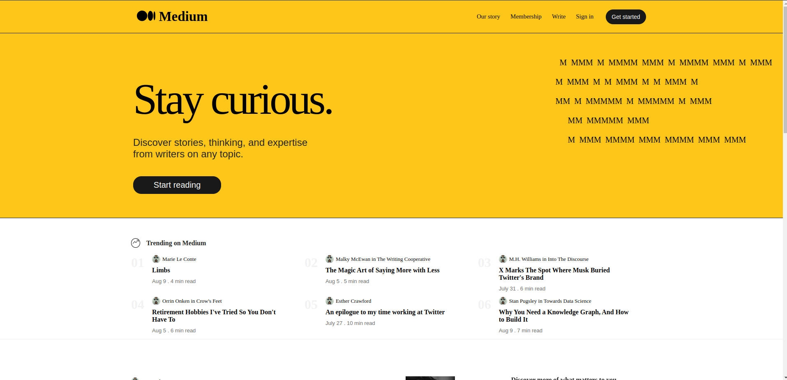

<h2><strong>Medium</strong>Content Management application</h2>
<br >

<hr >

<h4>Description</h4>
Introducing Medium: A platform for Sharing Ideas and earning while you do what you enjoy.<br>
Connect with like-minded individuals, engage in insightful conversations, and share your knowledge effortlessly.<br>
Our personalized experience and commitment to privacy set us apart, making Medium the go-to platform for those who value authenticity and connection.<br>
Join us today and redefine the way you connect in the digital age.
<br >

<h4>Installation Guide</h4>
I'll assume you already have <strong>Node</strong> installed.

Start by cloning the repo:

```
https://github.com/bismarkboateng/md-pro-rct.git
cd md-pro-rct
yarn
yarn dev
```

select the link running on your development server to preview<br>
the application